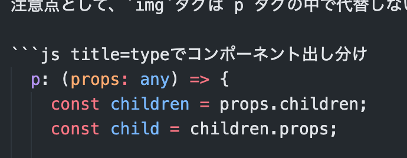

# ブログの取り扱い

NextJSとマークダウン(MDX)でブログを作ろうと思った時に、どのライブラリを使うか色々調べた結果、`mdx-bundler`というライブラリが一番作りやすいと感じたので、
簡単に構成を説明したいと思います。

## ブログ一覧

ブログの抽出は fs モジュールを使用しました。
ワーキングディレクトリに`content`フォルダを設置し、その中に mdx ファイルと画像が入っているディレクトリを作成します。
そのディレクトリ名をブログのスラグにしたものを<i>一つのブログ記事</i>と捉えると言う感じです。

ブログの一覧は、`join`や`readdirSync`、`readFileSync`など基本的な関数を用いて、全データを取得しています。
フロントマターは`gray-matter`を用いることで簡単に抽出することができます。

以下のコードは、「<u>content ディレクトリにアクセスし、全ての MDX ファイルのフロントマターとスラグを記事ごとに配列で返す</u>」関数です。

```javascript title=allPost.ts
export const allPosts = (): PostMetaProps[] => {
  const folderPath = join(process.cwd(), "content");
  const allFile = fs.readdirSync(folderPath, "utf8");

  const data = allFile.map((slug) => {
    const postPath = join(folderPath, `${slug}/index.mdx`);
    const raw = fs.readFileSync(postPath, "utf8");
    const { data } = matter(raw);

    return { ...data, slug };
  });

  return data;
};
```

## ブログ

冒頭の通り、mdx のコンパイラーには`mdx-bundler`を採用しました。  
理由は 3 つあります。

**1 つ目は、<u>カスタムコンポーネントを設定できる</u>こと。**  
引数`components`で、h1 や p、img タグをカスタムコンポーネントに代替できます。
注意点として、`img`タグは p タグの中で代替しないと余計な p タグがついてしまいます。なので、以下のようにします。

```js title=typeでコンポーネント出し分け
  p: (props: any) => {
    const children = props.children;
    const child = children.props;

    if (children.type === "img") {
      const { src, alt } = child;
      return (
        <div className="flex justify-center my-4">
          <Image src={src} alt={alt} height={520} width={520} />
        </div>
      );
    } else if (typeof children !== "string") {
      return (
        <p className="mb-12 md:mb-14 text-tiny md:text-base leading-9 md:leading-10 text-slate-700 dark:text-slate-300">
          {children}
        </p>
      );
    } else {
      return <>{children}</>;
    }
  },
```

**2 つ目は、簡単なプラグインを作成することで、<u>meta string を抽出</u>できること。**    
`meta string`とはコードブロックの言語指定と、同じ行にある文字列のことを指します。(以下の画像参照)この画像では、`title=type でコンポーネント出し分け`がそれに当たります。



これを以下のプラグインで取得します。`＝`で分割し、key(以下ではわかりやすいように name としていますが)と value のペアを JSON で`properties`に注入しています。

```javascript
  export const extractMetaString = () => {
    return (tree: any, index: any) => {
      visit(tree, "element", (node) => {
        if (node.type === "element" && node.tagName === "code" && node.data) {
          const meta = node.data.meta.split(/\s/g) as string[];

          const metaReduce = meta.reduce((acc: MetaProps, cur) => {
            const [name, value] = cur.split("=");
            return { ...acc, [name]: value };
          }, {});

          node.properties = {
            ...node.properties,
            data: JSON.stringify(metaReduce),
          };
        }
      });
    };
  };
```

このプラグインを`mdx-bundle`の`xdmOptions`に追加します

```javascript
const { code, frontmatter } = await bundleMDX<frontmatterProps>({
  source: raw,
  cwd: join(process.cwd(), "content", slug),
  xdmOptions: (options) => ({
    ...options,
    rehypePlugins: [...(options.rehypePlugins ?? []), extractMetaString], //highlight
  }),
  ...
```

これで、このブログのコードブロックの上に付いているタイトルのように表示させることができます

**3 つ目は、<u>画像の取り扱い</u>がわかりやすいこと。**  
`mdx-bundler`では、`remark-mdx-images`をプラグインとして画像を処理できます。  
以下のコードは`mdx-bundler`の全体像です。  

`xdmOptions`の`remarkPlugins`に`remark-mdx-images`を追加します。  
`esbuildOptions`にはesbuildのオプションを設定します。(`mdx-bundler`はesbuildを使っているようです)  

この`esbuildOptions`にて画像ファイルの扱いを指定します。  
ワーキングディレクトリ(ここではmdxファイルや画像ファイルがあるディレクトリ、つまり<i>一つのブログ記事</i>を指します)、にある画像を抽出して`outdir`に吐き出します。  
ここでは`outdir`には`public/images/[slug]`を指定しています。

さらに、publicPathを指定することで、mdxファイルの中で、画像パスを指定するときに  
`/images/[slug]`を書く必要がなくなります。

これらによって、<u>画像を記事ごとに管理しつつ</u>、画像をmdx上で扱えるというわけです。  

```javascript title=mdx-bundlerの全体像
  const { code, frontmatter } = await bundleMDX<frontmatterProps>({
    source: raw,
    cwd: join(process.cwd(), "content", slug), //ワーキングディレクトリ
    xdmOptions: (options) => ({
      ...options,
      remarkPlugins: [...(options.remarkPlugins ?? []), remarkMdxImages], //画像プラグイン
      rehypePlugins: [...(options.rehypePlugins ?? []), extractMetaString],
    }),
    esbuildOptions: (options) => ({
      ...options,
      outdir: join(process.cwd(), "/public/images", slug), //アウトプットされる場所
      loader: {
        ...options.loader,
        ".png": "file",
        ".jpeg": "file",
        ".jpg": "file",
        ".gif": "file",
      },
      publicPath: `/images/${slug}`, 
      write: true,
    }),
  });
```

# リンク
 
<a href="https://github.com/kentcdodds/mdx-bundler#component-substitution" target="_blank" rel="noopener noreferrer">`mdx-bundler`はこちらから</a>