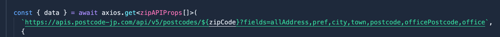

# PostcodeJP API デモ

以下は郵便番号または大口事業所個別番号から住所を検索するデモ

  <SearchAddress />

# PostcodeJP APIとは

PostcodeJP APIは郵便番号や住所を検索するAPI

特に筆者が魅力を感じた点は以下の通り

- 一般郵便番号に加え、大口事業所個別番号の検索にも対応
- 柔軟なアクセス制御
- ダッシュボードがわかりやすい
- シンプルで使いやす柔軟なAPI
- 丁寧なAPIリファレンス
- 良心的な6つの料金プラン

全体的に開発者に優しいサービスだなと感じた

料金プランは6つあり、Free(無料)プランから、Proプランまで柔軟に価格設定されている
基本的にプランの違いによってリクエスト回数とリクエストレートが異なる

Proプランだと、どちらも無制限である

開発者ダッシュボードでは

- 現在のAPIキー一覧
- 現在の料金プラン
- アカウント情報
- 次回の請求予定

を確認できる

APIキー一覧では
- APIキーの名前
- 作成日
- キーの値
- 今日の使用量

が表示されており、名前をクリックすると、APIキーの制限を設定する項目がある画面へ 
ここで3つのアクセス制御から選択できる

- なし
- HTTP リファラー
- IP アドレス

制限したリファラーやIPアドレスは複数設定できる

# PostcodeJP APIの使い方

PostcodeJP APIには、住所に関するAPIが3つあるが、今回は郵便番号APIの郵便番号取得のリファレンスを参考に、
郵便番号から郵便番号リソース(郵便番号や都道府県、市区町村、町域など)を検索してみる

使い方はシンプル

`https://apis.postcode-jp.com/api/v5`がエンドポイントのURL

リクエストにAPIキーをセットした上で  
パスパラメータに`postcode`として検索したい郵便番号または大口事業所個別番号を入れる

例えば

`https://apis.postcode-jp.com/api/v5/postcodes/7470031`

これで、郵便番号が7470031の郵便番号リソースを検索できる

APIのレスポンスは<a className="ex_link" href="https://api-doc.postcode-jp.com/#a682326cdb" target="_blank" rel="noopener noreferrer">リファレンス</a>に載っている  
(旧郵便番号や大口事業所名、がな、カタカナ、コード、緯度、経度も取得できる)

一つの郵便番号に対して、複数地域が候補に挙がることもあるのでレスポンスは<u>配列</u>に入っている

また必要な項目のみを取得できる部分応答も可能  
リクエストのクエリパラメータ`fields`を使って、必要な項目を指定できる

デモでは、以下の画像の通り、`fields`に`allAddress`,`pref`,`city`,`town`,`postcode`,`officePostcode`,`office`を指定している

郵便番号をinputタグから取得し、`useEffect`を用いてAPIを走らせている  

# リンク
  
<a className="ex_link"  href="https://postcode-jp.com/" target="_blank" rel="noopener noreferrer">PostcodeJP API ホームページ </a>  
<a className="ex_link"  href="https://api-doc.postcode-jp.com/#api-v5" target="_blank" rel="noopener noreferrer">PostcodeJP API v5リファレンス </a>